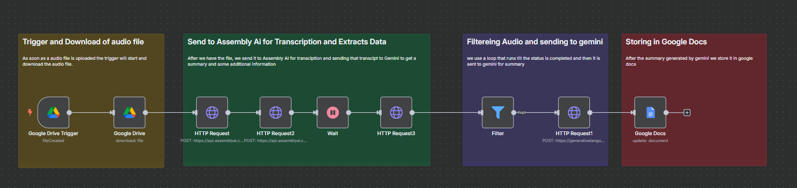
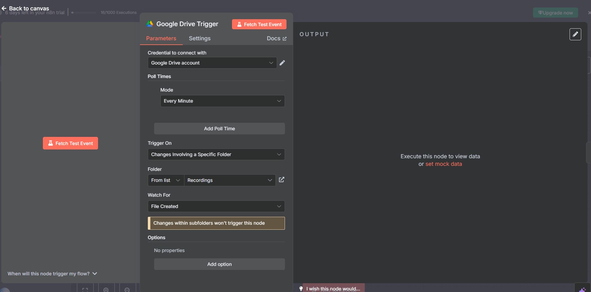
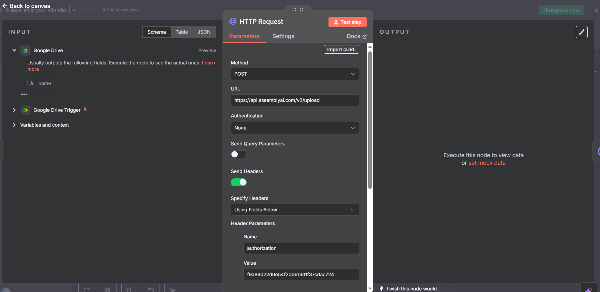
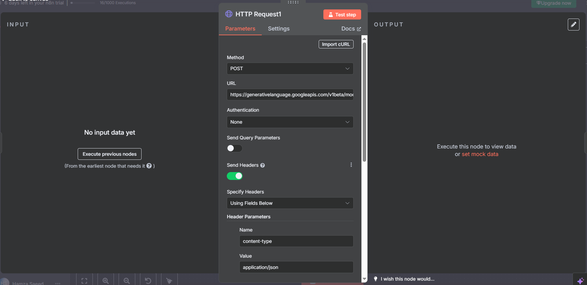

# Audio-Transcribing-Automation
# 🎧 AI-Powered Audio Transcription and Summarization Workflow using n8n

This project automates the process of transcribing and summarizing audio files using **n8n** — an open-source workflow automation platform. When an audio file is uploaded to Google Drive, the system automatically:

1. Downloads the audio file
2. Transcribes the content using an AI-powered transcription tool
3. Summarizes the transcription using **Google Gemini**
4. Sends the summary to **Google Docs** for easy access and storage

---

# 🚀 Features

- 🔁 Automated trigger on new file uploads in Google Drive
- 🎙️ AI-based transcription using [AssemblyAI](https://www.assemblyai.com/) or OpenAI Whisper
- 🧠 Summarization using [Google Gemini Pro](https://ai.google.dev/)
- 📄 Summary delivery via Google Docs
- 🧩 Built entirely in **n8n** (no-code/low-code tool)

---

# 📌 Technologies Used

| Tool/Service      | Purpose                                   |
|-------------------|-------------------------------------------|
| [n8n](https://n8n.io/)          | Workflow automation engine           |
| Google Drive      | File upload trigger and audio source      |
| AssemblyAI / Whisper | Audio transcription                     |
| Google Gemini     | Summarization and content generation       |
| Google Docs       | Save and store summaries                   |

---

# 📁 Workflow Structure

### 1. **Trigger on File Upload**
- **Google Drive Trigger** (`fileCreated`)
- Watches for new `.mp3` / `.wav` uploads to a specified folder

### 2. **Download Audio File**
- **Google Drive Download** node

### 3. **Transcription**
- **Option A: AssemblyAI API**
  - Upload audio and poll for transcript
- **Option B: OpenAI Whisper (local)**

### 4. **Summarization**
- **Google Gemini Chat Model** node
  - Input: transcript text
  - Output: summarized version of content

### 5. **Send to Google Docs**
- **Google Docs node**
  - Create a new document
  - Insert summary text with a custom title

---

## 📷 Screenshots

| Step | Description |
|------|-------------|
|  | Workflow setup in n8n |
|  | Google Drive trigger |
|  | Gemini summarization |
|  | Summary saved to Google Docs |

---

